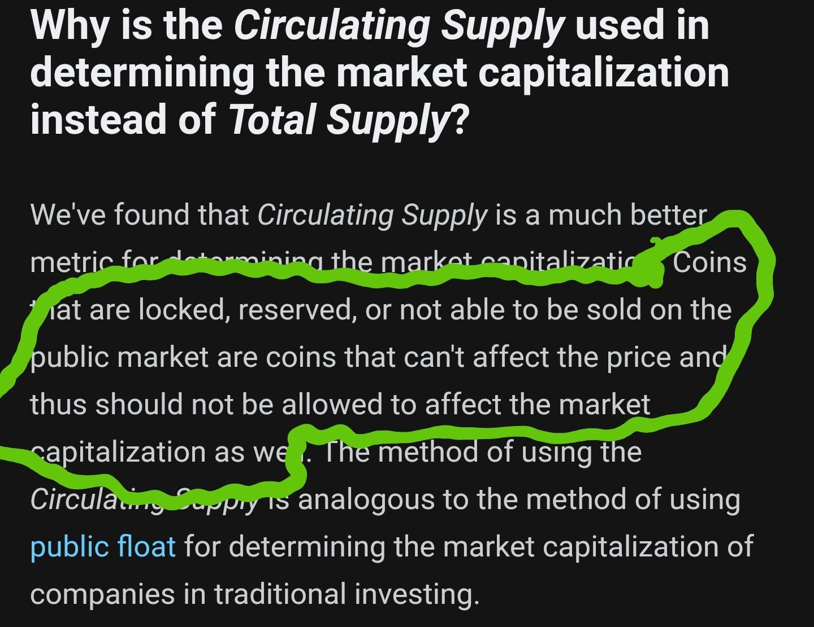

## New to HEX?

HEX is an ERC Token on Ethereum that is designed to increase in value over time. 
It is an high interest earning token with a twist - to get the higher interest, you must time-lock your funds!

What does this mean? It means that while your funds are locked away for X - days it generates interest.
Here's the  great part - you can lock it for any amount of time - 10 days, 30 days, 365 days, and the longer your locking period, the more interest you get PAID.

So what happens when you lock up coins? The available supply becomes lower. Which drives the price up. Yes, it's THAT simple!
When your coins are released from their time-lock, their value will be much more, AND you got more while you were HODLING.

# For the next year you can get HEX in two ways.

### What you need to know to get started.

#### Method 1: Claiming free HEX for owning Bitcoin
If you have BTC in your possesion (Your keys, your BTC; not your keys, not your BTC!) then you can claim some for free anytime in the next year! Simply sign a message using your wallet and the HEX coins go into your HEX wallet. Not even a single satoshi will be spent or transmitted! Completely safe!

#### Method 2: Buy with ETH
But if you don't have BTC before that timer goes out, the snapshot period will be over and you will have missed the chance to claim some HEX for free. But don't dispair! You can buy HEX anytime within the next year using ETH.

Buying HEX with ETH is very straight forward, but how much you recieve is reset but reduces each day you wait. So it's important you do not wait!

## THE YEAR LONG HEX RELEASE PARTY STARTS ON DEC 2nd!!
### WHEN THE PARTY'S OVER EXCHANGES WILL BE THE ONLY WAY TO GET HEX.

Each day during the token release party the amount of HEX to be released will cut in half

This means if you wait, you won't be getting much HEX. When you buy HEX with ETH you get a porportional amount of HEX.
This is easier to explain with an example.

## <a href="https://hex.win/?r=0xba48a1f5596d1d9d443f99f7388c9094aaf1d719">10% SIGNUP BONUS LINK</a>
On any given day during the party:
If 2 People both put 5 ETH in at the same time then they will both get 50% of what's dropped that day.
If 10 People put 1 ETH in then they will each get 10% of the HEX released that day.
If 2 People put 1 ETH and 10 ETH in then each get 10% and 90% respectivly of the HEX released that day.

At the end of each day, the hex is dispersed and reset for the next day, but with only half as much HEX.

This means the sooner you get in, the more you will get. 

Don't miss out! You will remember this page when the coin marketcap looks like this:

